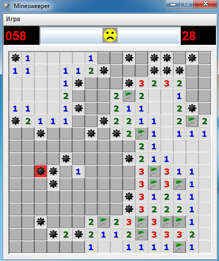
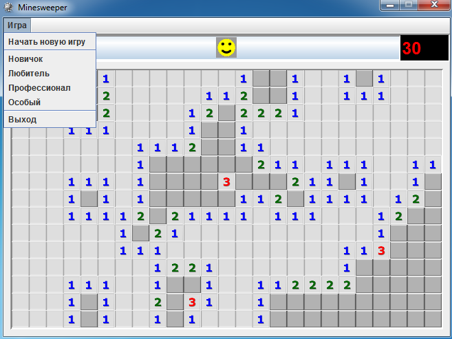
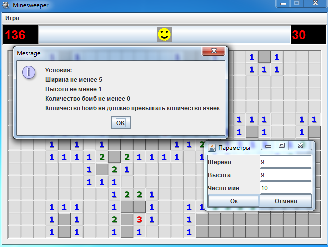

# Minesweeper

<p align="middle">
    
   
   
</p>

## How to play

```sh
$ wget https://raw.githubusercontent.com/zCRUSADERz/AlexanderYakovlev/master/minesweeper/executable/Minesweeper.jar
$ java -jar Minesweeper.jar
```

and play !

For **Windows**, simply download [this](https://raw.githubusercontent.com/zCRUSADERz/AlexanderYakovlev/master/minesweeper/executable/Minesweeper.jar) jar file and run it with `java -jar Minesweeper.jar`.

**Please do report issues in case of a bug.**